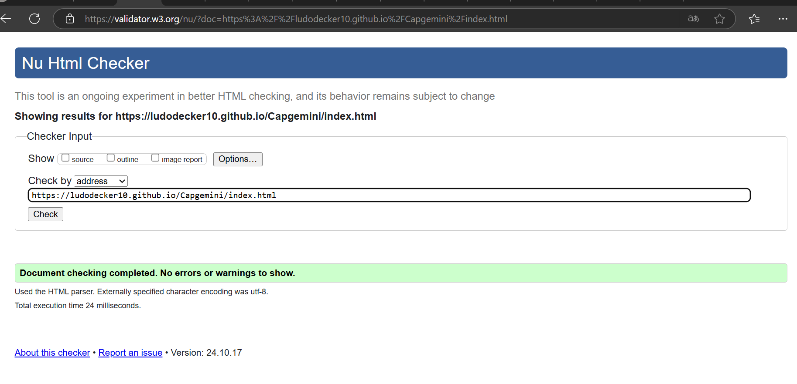
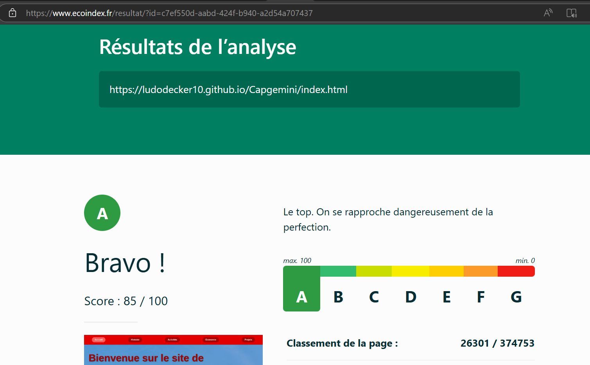
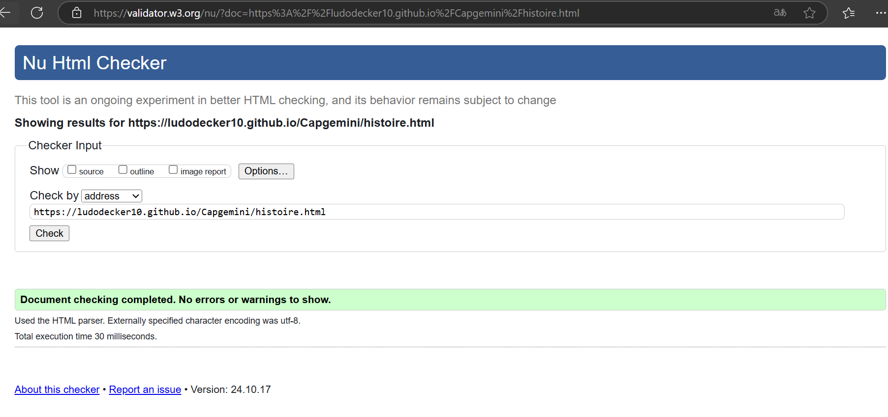
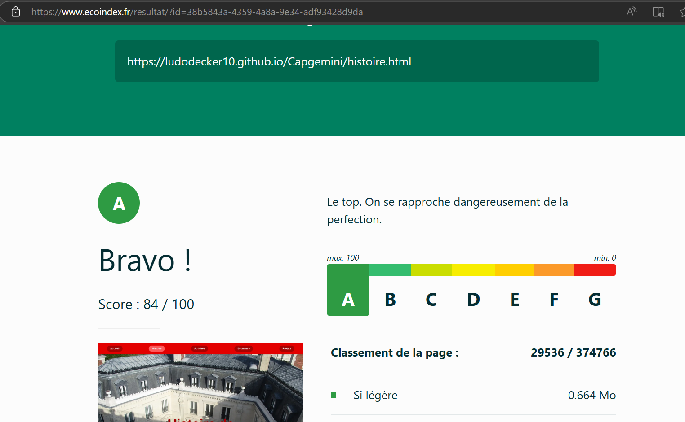
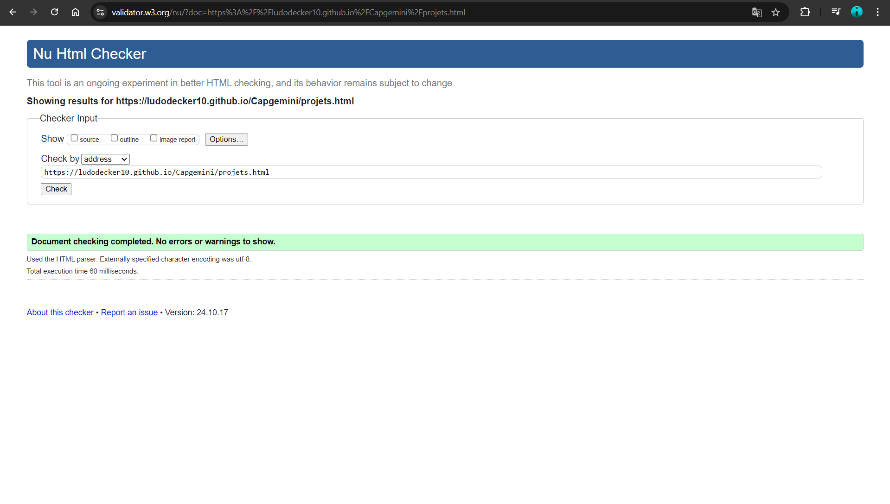

# Présentation Capgemini    

## Capgemini

[Présentation Capgemini](https://ludodecker10.github.io/Capgemini/)

## Membres du groupe :

Etudiant 1 (référent du groupe) :  [Luca DE CASTRO--WAGNER](mailto:luca.de_castro--wagner@edu.univ-fcomte.fr?subject=SAE_1_05_06)  
Etudiant 2 : [Ludovic DECKER](mailto:ludovic.decker@edu.univ-fcomte.fr?subject=SAE_1_05_06)   
Etudiant 3 : [Martin CUINET](mailto:martin.cuinet02@edu.univ-fcomte.fr?subject=SAE_1_05_06)  
Etudiant 4 : [Jules CLERC-VOUILLOT](mailto:jules.clerc-vouillot@edu.univ-fcomte.fr?subject=SAE_1_05_06)  

# Présentation du projet

Notre projet constiste à faire la présentation de l'entreprise française : Capgemini. 

Nous voulons créer un site internet contenant 5 pages : une page Accueil, qui présente l entreprise, une page Histoire qui reprend toute l'histoire de Capgemini, du début de l'entreprise à aujourd'hui, une page Activités, qui présente les différents secteurs d'activités de l'entreprise, une page Economie qui montre les finances et l'analyse économique de Capgemini, et enfin une page Projets, qui reprend tout les projets passés, actuels et futurs de l'entreprise.

## Choix de conception  

Pour la conception du site, nous nous sommes grandement inspirés du site officiel de Capgemini (disponible [ici]((https://www.capgemini.com/fr-fr))), et de plusieurs autres sites d'entreprises technologiques.    

## Développement Site Web et Validation des pages

### Page d'accueil

**Auteur : CUINET Martin**  

Vérification W3C : [Détail ICI](https://validator.w3.org/nu/?doc=https%3A%2F%2Fludodecker10.github.io%2FCapgemini%2Findex.html)

### page histoire

**Auteur : CUINET martin**  

Verification W3C : [Détail ICI](https://validator.w3.org/nu/?doc=https%3A%2F%2Fludodecker10.github.io%2FCapgemini%2Fhistoire.html)

### page activités

**Auteur : DECASTRO--WAGNER Luca**  

Verification W3C : [Détail ICI](https://validator.w3.org/nu/?showsource=yes&showoutline=yes&showimagereport=yes&doc=https%3A%2F%2Fdemo-am90.github.io%2Fs1-demo%2Findex.html)

### page économie

**Auteur : CLERC-VOUILLOT Jules**  

Verification W3C : [Détail ICI](https://validator.w3.org/nu/?showsource=yes&showoutline=yes&showimagereport=yes&doc=https%3A%2F%2Fdemo-am90.github.io%2Fs1-demo%2Findex.html)

 

 

### page projets

**Auteur : DECKER Ludovic**  

Verification W3C : [Détail ICI](https://validator.w3.org/nu/?showsource=yes&showoutline=yes&showimagereport=yes&doc=https%3A%2F%2Fdemo-am90.github.io%2Fs1-demo%2Findex.html)

 

 

## Répartition du travail

### Planification - Diagramme de GANTT

- CUINET Martin
- DECASTRO--WAGNER Luca

### Recherches d'informations

- DECKER Ludovic 
- CUINET Martin
- DECASTRO--WAGNER Luca
- CLERC-VOUILLOT Jules

### Rapport économique

- DECKER Ludovic (+ mise en page)
- CUINET Martin
- DECASTRO--WAGNER Luca

### Développement site

- CUINET Martin
  - Page d’accueil
  - "Template" de page (Navbar/Footer)
  - Page histoire
- DECASTRO--WAGNER Luca
  - Page activités
- DECKER Ludovic
  - Page projets
  - "Template" de page (Navbar/Footer)
- CLERC-VOUILLOT Jules
  - Page économie

